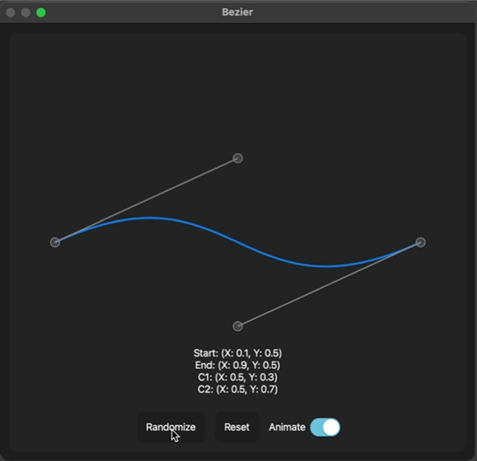

# CurvesUI

SwiftUI package to conveniently draw, edit and animate cubic bezier curves.

## Features
* `BezierView` that offers a normalized control point binding to draw the curve
* `isEditing` Binding to change edit state and show / hide the control points and manipulation handles
* supports the SwiftUI animation system to fluidly change between different curve configurations
